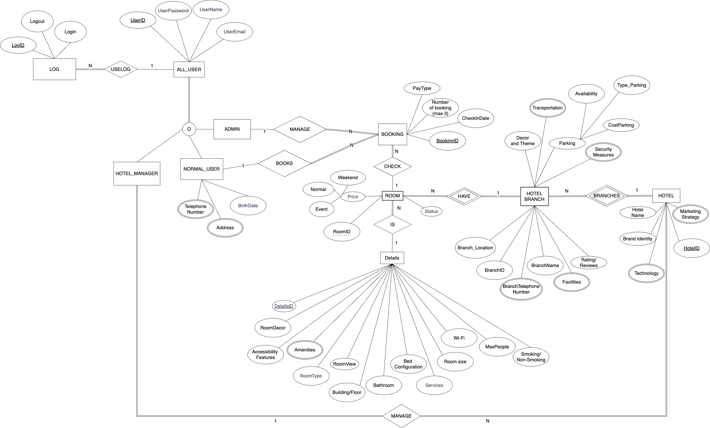
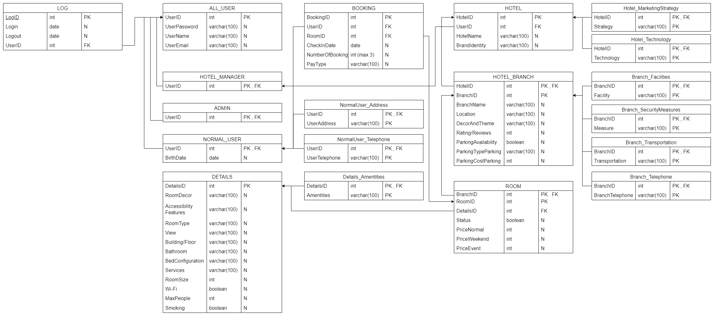

# Hotel Booking

## 1. ER Diagram (Chen's notation)



## 2. Schema diagram with referential integrity


//


## Projet Funtion Requirement

1. The system shall allow a user to register by specifying the name, telephone number, email, and password.
    - [cmd1_register_all_user](./SQL_Commands/cmd1_register_all_user.sql)
2. After registration, the user becomes a registered user, and the system shall allow the user to log in to use the system by specifying the email and password. The system shall allow a registered user to log out.
    - [cmd2_login_user](./SQL_Commands/cmd2_login_user.sql)
3. After login, the system shall allow the registered user to book up to 3 nights by specifying the date and the preferred hotel. The hotel list is also provided to the user. A hotel information includes the hotel name, address, and telephone number.
    - [cmd3_1_insert_booking_with_user_and_room](./SQL_Commands/cmd3_1_insert_booking_with_user_and_room.sql)
    - [cmd3_2_user_view_all_room](./SQL_Commands/cmd3_2_user_view_all_room.sql)
4. The system shall allow the registered user to view his hotel bookings.
    - [cmd4_user_view_bookings](./SQL_Commands/cmd4_user_view_bookings.sql)
5. The system shall allow the registered user to edit his hotel bookings.
    - [cmd5_user_edit_booking](./SQL_Commands/cmd5_user_edit_booking.sql)
6. The system shall allow the registered user to delete his hotel bookings.
    - [cmd6_user_delete_booking](./SQL_Commands/cmd6_user_delete_booking.sql)
7. The system shall allow the admin to view any hotel bookings.
    - [cmd7_admin_view_bookings](./SQL_Commands/cmd7_admin_view_bookings.sql)
8. The system shall allow the admin to edit any hotel bookings.
    - [cmd8_admin_edit_booking](./SQL_Commands/cmd8_admin_edit_booking.sql)
9. The system shall allow the admin to delete any hotel bookings
    - [cmd9_admin_delete_booking](./SQL_Commands/cmd9_admin_delete_booking.sql)

 <!-- 10. LOGIN LOG \*\* additional Logs requirement from TA Aussie
     - [create_login_log](functions/create_login_log.sql) -->

## Document-based design schema

```JSON
{
    "title": "BOOKING",
    "required": [
        "BookingID",
        "UserID",
        "RoomID",
        "CheckInDate",
        "PayType",
        "NumberOfBooking"
    ],
    "properties": {
        "BookingID": {
            "bsonType": "int",
            "description": "The unique identifier for each booking",
            "unique": true
        },
        "UserID": {
            "bsonType": "int",
            "description": "The unique identifier for each user"
        },
        "RoomID": {
            "bsonType": "int",
            "description": "The unique identifier for each room"
        },
        "CheckInDate": {
            "bsonType": "date",
            "description": "The date when the booking is made"
        },
        "PayType": {
            "bsonType": "string",
            "description": "The payment type for the booking"
        },
        "NumberOfBooking": {
            "bsonType": "int",
            "description": "The number night of bookings made by the user",
            "maximum": 3
        }
    }
}
```
